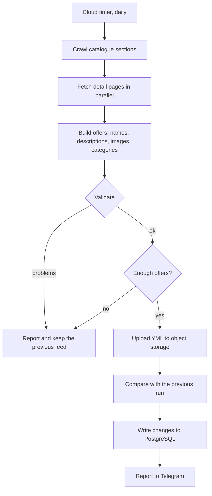

# Ad feed robot

[](https://github.com/harl95van-cpu/ad-feed-robot/actions/workflows/tests.yml)

A scheduled job that keeps a product feed for ad platforms in sync with the
advertiser's website, and records every change it finds along the way.

It runs unattended in a cloud function, so most of the code is about the things
that go wrong when nobody is watching: the site changes its markup, a price
silently drops, half the catalogue disappears behind a 500, or the copy picks up
a legal claim the advertiser is not allowed to make.

## The problem

Ad platforms take a product feed — an XML file listing everything you sell —
and turn it into dynamic ads. The feed has to match the site: same prices, same
availability, same URLs. When it drifts, you pay for clicks that land on a page
with a different price, or on a product that no longer exists.

Advertisers usually delegate the feed to whoever owns the website. In practice
that means a queue: the feed is a low-priority ticket, and it can sit for weeks
while the ad account keeps spending. This robot takes the feed out of that
queue — it builds its own copy from the public catalogue, hosts it, and reports
what changed.

## How a run works



Two guards decide whether the new feed is allowed to replace the live one:

- **Validation** — duplicate ids or URLs, categories outside the reference list,
  empty required fields, a crossed-out price that isn't actually higher, names
  over the platform's 100-character limit. Any of these would get the feed
  rejected on the platform side, so the run stops instead.
- **Minimum offers** — if the crawl returns fewer offers than the configured
  floor, something broke on the site rather than in the catalogue. Publishing
  that would wipe most of the advertiser's dynamic ads, so the run stops and
  reports instead.

A failed run is not a lost day: the previously published feed stays in place and
keeps serving.

## What gets recorded

The feed itself is stateless — it describes what the catalogue looks like today.
The interesting part is the difference between runs, so each run also writes:

- **`feed_changes`** in PostgreSQL — one row per event: a programme appeared,
  disappeared, or changed price, with both the old and the new value. This is
  what answers "when did they raise the price on the thing we're advertising",
  and it joins against ad statistics living in the same database.
- **`programs`** — the full catalogue as a table, with the URL path normalised
  the same way the CRM stores landing pages. That turns "which product did this
  lead come for" from a manual mapping into a join.
- **A per-run JSON report** in object storage, and a monthly summary on the
  first of each month.

## Modules

| Module | Responsibility |
| --- | --- |
| `main.py` | Orchestration, the diff against the previous run, and the cloud function entry point |
| `crawler.py` | Fetches listing and detail pages; two listing layouts behind one `profile` setting |
| `feed.py` | Builds offers, enforces copy rules and platform limits, renders YML |
| `clusters.py` | Groups programmes into topics so related items can share creative |
| `storage.py` | Object storage (S3-compatible) |
| `history.py` | Change history in PostgreSQL |
| `catalog.py` | Publishes the catalogue as a joinable table |
| `notify.py` | Telegram reporting |
| `generate_images.py` | Generates creative through an image model, tracking real per-image cost |

Everything client-specific lives in the config, not the code: catalogue
sections, category reference list, banned marketing phrases, image fallbacks,
the minimum-offers floor. Adding an advertiser is a config entry, not a fork.

## Running it

```bash
pip install -r requirements.txt
cp feed_robot/clients.example.json feed_robot/clients.json
```

Fill in the config, then do a dry run that writes the feed locally and touches
nothing remote:

```bash
python feed_robot/main.py --client demo --dry-run --out feed.yml
```

A real run uploads the feed, records history and reports:

```bash
python feed_robot/main.py --client demo
```

### Environment

See `.env.example`. Secrets are read from the environment and never committed —
object storage keys, PostgreSQL credentials, the Telegram token.

### Deployment

The package is deployed flat into a cloud function with a daily timer, which is
why its modules import each other by bare name rather than as a package.

One deployment detail worth knowing: `api.telegram.org` is not reachable from
the cloud region this runs in. Reporting therefore goes through a small relay
that is reachable from both sides, with the direct API kept as the fallback for
local runs.

## Tests

```bash
pytest
```

The tests cover the logic where a silent failure is expensive: the diff between
runs, both listing parsers, the copy rules, and feed validation. Network,
storage and database calls are not tested here — those are integration
concerns, and the modules are separated so they can be exercised on their own.

## What I would do differently

- **Layout parsing is regex over HTML.** It works because the site is a stable
  Bitrix template, and the minimum-offers guard catches the day it isn't. A
  parser over a DOM tree would be more honest.
- **Configs are files.** With a handful of advertisers this is fine and easy to
  review in a diff. Past that, the config belongs in the database next to the
  history it produces.
- **The scheduler is a plain timer.** There are no dependencies between runs
  today, so a full orchestrator would be overhead — but retries and backfills
  are currently manual, and that is where it starts to hurt.
