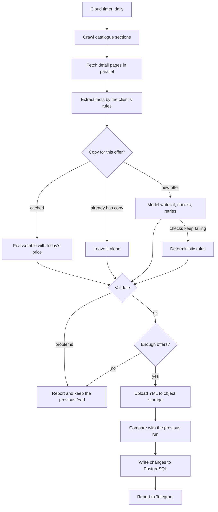

# Ad feed robot

[](https://github.com/harl95van-cpu/ad-feed-robot/actions/workflows/tests.yml)

A scheduled job that keeps a Yandex Direct product feed in sync with the
advertiser's website, writes the ad copy for programmes it has not seen before,
and records every change it finds along the way.

It is built for **online education** — courses, retraining, professional
development — and for **Yandex Direct** specifically. Both are load-bearing. The
copy rules know that a programme issues a diploma or a certificate depending on
its type; the length limits are the ones Direct applies when it renders a smart
banner, not the ones the feed format allows. Google Ads feeds are a different
format with different rules, and this code does not target them.

It runs unattended in a cloud function, so most of it is about what goes wrong
when nobody is watching: the site changes its markup, a price silently drops,
half the catalogue disappears behind a 500, a language model writes a profession
the course does not teach.

## The problem

Ad platforms take a product feed — an XML file listing everything you sell — and
turn it into dynamic ads. The feed has to match the site: same prices, same
availability, same URLs. When it drifts you pay for clicks that land on a page
with a different price, or on a product that no longer exists.

Advertisers usually delegate the feed to whoever owns the website. In practice
that means a queue: the feed is a low-priority ticket and it can sit for weeks
while the ad account keeps spending. This robot takes the feed out of that
queue — it builds its own copy from the public catalogue, hosts it, writes the
ads and reports what changed.

## How a run works



Two guards decide whether the new feed may replace the live one:

- **Validation** — duplicate ids or URLs, categories outside the reference list,
  empty required fields, a crossed-out price that isn't actually higher, names
  over the platform's limit. Any of these would get the feed rejected, so the
  run stops instead.
- **Minimum offers** — if the crawl returns fewer offers than the configured
  floor, something broke on the site rather than in the catalogue. Publishing
  that would wipe most of the advertiser's dynamic ads.

A failed run is not a lost day: the previously published feed stays in place and
keeps serving.

## Writing the ad copy

The rules that used to write titles were regular expressions tuned to one site's
page titles, and they broke on anything unusual. A model writes them now — but
only the wording, and only once per programme.

**Facts are extracted deterministically; the model only phrases them.** The
profession, the programme name, the hours, the duration and the programme type
are pulled out of the page by rules that live in the client's config next to the
layout profile. Every site hides the same fact somewhere different: on one the
duration sits in a spec line halfway down the page, on another it is absent
entirely — and that page instead offers three other numbers measured in months:
an instalment plan, a payment schedule, how long access lasts. A rule carries a
`reject` guard for exactly that. **A fact that is not found is a normal outcome,
not a reason to guess:** the ad template is required to render without it.

**The model returns a name, not a line.**

```json
{"mode": "profession", "name": "Speech therapist", "accusative": "speech therapist"}
```

Everything else is arithmetic, and arithmetic belongs in code. Asking a model to
count characters does not work: it takes a long qualification verbatim and blows
the limit, or it mangles the name to make room for decoration. So the code
assembles the line, and when it does not fit, **the decoration goes and the name
never does**:

| Rung | Title |
| --- | --- |
| 0 | `Training as a Speech therapist. Diploma!` |
| 1 | `Training as a Speech therapist` |
| 2 | `Speech therapist. Diploma!` |
| 3 | `Speech therapist` |

A title that says exactly what the course is beats a well-formed one that says
something else. On a real catalogue about a quarter of offers give up some
decoration this way.

**Nothing numeric is written by the model.** The price is substituted on every
build, because a price change must not trigger a rewrite — rewriting an offer
resets the statistics the ad platform has accumulated for it. The duration is
frozen into the cached entry for the same reason.

**Every answer is checked before it is used.** Lengths; the ending; that both
lines open the same way; that every significant word of the name is backed by
the extracted facts; that no figure appeared which the facts did not contain;
banned phrases; and the shapes a phrase takes when it was cut in the wrong place
— a dangling dash, half a bracket, a doubled ending, a repeated word. A failed
check is sent back to the model with the specific complaint, twice, and then the
offer falls back to the deterministic rules. **A model failure costs copy
quality, never the daily rebuild.**

**The model is called for new programmes only.** An offer that already has copy
keeps it, unless that copy is broken. In steady state this is a handful of calls
a day at roughly $0.0003 each.

## Judging a change to the prompt

`feed_robot/eval/` holds the harness. A prompt edit is judged on a fixed
reference set of live programmes, not on whichever offers happened to be new
that day:

- `build_reference.py` samples programmes evenly across catalogue sections —
  taken off the top they would be a dozen variations of one profession, and the
  awkward cases would be missing.
- `eval_texts.py` runs generation over the set and reports pass rate, retries,
  how far down the ladder the assembly had to go, and cost. `--against` an
  earlier run prints only what moved: an edit meant to fix three programmes
  should not quietly reword forty.
- `judge.py` scores readability and fidelity with a second model, and compares
  two runs pairwise with the positions shuffled. It is deliberately not in the
  daily job. Treat its verdict as a signal, not a ruling — a judge that is not
  told what the assembly does on purpose will mark down every trimmed title.
- `wordstat_compare.py` settles wording questions by search demand rather than
  opinion, comparing whole commercial phrases rather than single words.

## What gets recorded

The feed is stateless — it describes the catalogue today. The difference between
runs is the interesting part, so each run also writes:

- **`feed_changes`** in PostgreSQL — one row per event: a programme appeared,
  disappeared or changed price, with both values.
- **`programs`** — the catalogue as a table, with the URL path normalised the
  way the CRM stores landing pages, so "which product did this lead come for"
  is a join rather than a manual mapping.
- **A per-run JSON report** in object storage, and a monthly summary.

## Modules

| Module | Responsibility |
| --- | --- |
| `main.py` | Orchestration, the diff against the previous run, cloud function entry point |
| `crawler.py` | Fetches listing and detail pages; two listing layouts behind one `profile` setting |
| `facts.py` | Extracts facts by the client's configured rules, with a model-assisted fallback |
| `texts.py` | The prompt, the assembly ladder, and every check on what the model returns |
| `llm.py` | Model access: retries, spend ceiling, and the relay for networks the provider refuses |
| `feed.py` | Builds offers, enforces copy rules and platform limits, renders YML |
| `clusters.py` | Groups programmes into topics so related items can share creative |
| `storage.py` | Object storage (S3-compatible) |
| `history.py` | Change history in PostgreSQL |
| `catalog.py` | Publishes the catalogue as a joinable table |
| `notify.py` | Telegram reporting |
| `generate_images.py` | Generates creative through an image model, tracking real per-image cost |

Everything client-specific lives in the config, not the code: catalogue
sections, category reference list, extraction rules, banned phrases, the
document each programme type issues, the model and its spending limits. Adding
an advertiser is a config entry, not a fork.

## Running it

```bash
pip install -r requirements.txt
cp feed_robot/clients_config.example.json feed_robot/clients_config.json
```

Fill in the config, then do a dry run that writes the feed locally and touches
nothing remote:

```bash
python feed_robot/main.py --client demo --dry-run --out feed.yml
```

`--no-generate` skips the model entirely, which makes a dry run free.

A real run uploads the feed, records history and reports:

```bash
python feed_robot/main.py --client demo
```

### Environment

See `.env.example`. Secrets are read from the environment and never committed.
Object storage is required; PostgreSQL and Telegram are optional; model access
is required for generated copy and creative.

### Deployment

The package is deployed flat into a cloud function with a daily timer, which is
why its modules import each other by bare name rather than as a package.

The cloud region this runs in reaches neither `api.telegram.org` nor
`openrouter.ai` — the latter answers 403 to the whole network. Both therefore go
through a small relay (`relay/`, one file per endpoint, deployable to any
serverless host). **The relay holds the model API key**, so the job is deployed
without one and cannot spend money except through an endpoint that forwards two
specific calls. Direct access is used automatically wherever it works, such as
on a laptop.

## Tests

```bash
pytest
```

The tests cover the logic where a silent failure is expensive: the diff between
runs, both listing parsers, fact extraction and its guards, the assembly ladder,
every check on the model's output, where an offer's copy comes from, and what
happens when the provider is down. No network, storage or database calls — the
model is a stub that answers from a script.

## What I would do differently

- **Layout parsing is regex over HTML.** It works because the sites are stable
  templates, and the minimum-offers guard catches the day they are not. A parser
  over a DOM tree would be more honest.
- **Configs are files.** With a handful of advertisers this is fine and reviews
  well in a diff. Past that the config belongs in the database next to the
  history it produces.
- **The scheduler is a plain timer.** There are no dependencies between runs
  today, so an orchestrator would be overhead — but retries and backfills are
  manual, and that is where it starts to hurt.
